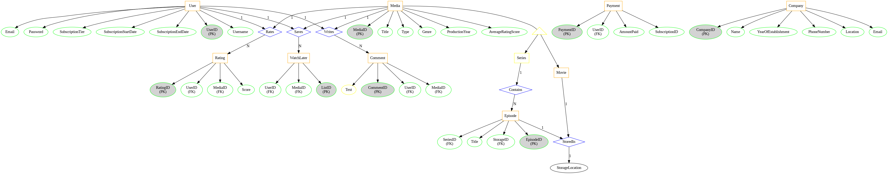
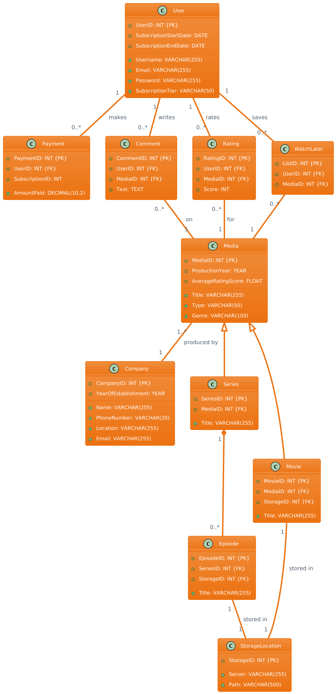

# Design and Implementation of a Database for a Media Streaming Service

## Overview
In this project, I designed and built a database for a **Media Streaming Service**. The database stores critical information such as:
- User profiles
- Subscription details
- Payment histories
- Personalized watch lists

Additionally, it manages media assets, including movies and series with multiple episodes while tracking their storage locations and associated production companies. The system ensures that all data is efficiently organized to support user activities like:
- Leaving comments
- Rating media
- Curating a watch list for future viewing

## Specifications
The database was designed with the following features:
- Each user can subscribe to the service for a specific period. The subscription start and end dates (including subscription tier) are stored.
- The users' payment history, including related subscription and transaction details, is tracked.
- A media entity can be a movie or a series and includes:
  - Genre
  - Production year
  - Average rating score
  - Director
  - Actors
  - Producers
  - List of comments left by users
- Users can leave multiple comments for a media entity but can only rate each item once.
- A series consists of multiple episodes. Each movie or episode of a series must have a storage location, which stores the server and path of the media file.
- Each movie or series belongs to a production company, and its details (name, year of establishment, and contact information) are stored.
- Each user has a ‘Watch Later’ list to which specific movies or episodes of a series can be added.

## Requirements Analysis

### Entities
The following entities were identified based on the specifications:
- **User**: Represents users of the streaming service, storing their personal and subscription information.
- **Payment**: Records payment details for users' subscriptions.
- **Media**: Stores information about movies and series.
- **Company**: Represents production companies.
- **Comment**: Stores users' comments on media.
- **Episode**: Represents individual episodes in a series.
- **Movie**: Represents movies in the system.
- **Series**: Represents series, which consist of multiple episodes.
- **StorageLocation**: Stores details about the storage of media files.
- **Rating**: Stores ratings for media items given by users.
- **WatchLater**: Tracks the "Watch Later" list for users.

### Relationships
The relationships between entities are as follows:

| **Entity1**      | **Entity2**     | **Type**        | **Explanation**                                                                 |
|------------------|-----------------|-----------------|---------------------------------------------------------------------------------|
| User             | Payment         | One-to-Many     | A user can make multiple payments.                                              |
| User             | Comment         | One-to-Many     | A user can leave multiple comments on media items.                              |
| User             | Rating          | One-to-Many     | A user can rate multiple media items, but only once per item.                   |
| User             | Watch Later     | Many-to-Many    | A user can save multiple media items to their "Watch Later" list.               |
| Media            | Production Company | Many-to-One    | Many media items can belong to a single production company.                     |
| Series           | Episode         | One-to-Many     | A series can have multiple episodes.                                            |
| Movie/Episode    | StorageLocation | One-to-One      | Each movie or episode has one unique storage location.                          |
| Media            | Comment         | One-to-Many     | Each media item can have multiple comments.                                     |
| Media            | Rating          | One-to-Many     | Each media item can have multiple ratings.                                      |

## Conceptual Database Design

### Enhanced Entity-Relationship (EER) Diagram
Below is the Enhanced Entity-Relationship (EER) diagram that visually represents the entities, attributes, and relationships between them in the database:

This diagram showcases entities like **User**, **Payment**, **Media**, **Comment**, **Episode**, **Rating**, and **WatchLater**, and how they interact in the database.

### UML Diagram
The UML diagram represents the structural relationships between objects and their interactions. This is useful for understanding the flow of data across the system.

This diagram helps visualize the interaction between components such as **User**, **Subscription**, **Media**, **Payment**, and **Watch Later** lists.

## Step-by-Step Explanation
Each entity and its relationships are carefully selected to reflect the key functionalities of a media streaming service:
- **Users** are linked to their **Payments**, **Comments**, **Ratings**, and **Watch Later** lists, supporting interactions like leaving feedback and managing media preferences.
- **Media** items (movies and series) are linked to **Production Companies** and have a direct relationship with **Comments** and **Ratings** for user feedback.

## Constraints
The database design incorporates various constraints to maintain data integrity:
- **Primary Keys** uniquely identify records.
- **Foreign Keys** maintain referential integrity between related tables (e.g., linking **Payment** to **User**).
- **Unique Constraints** ensure that data such as **Username** and **Email** are unique.

## Conclusion
This project outlines the design and implementation of a database for a media streaming service, capturing user data, media details, and their interactions. The system efficiently supports critical features such as subscription management, media rating, and comment handling, ensuring a smooth user experience.
